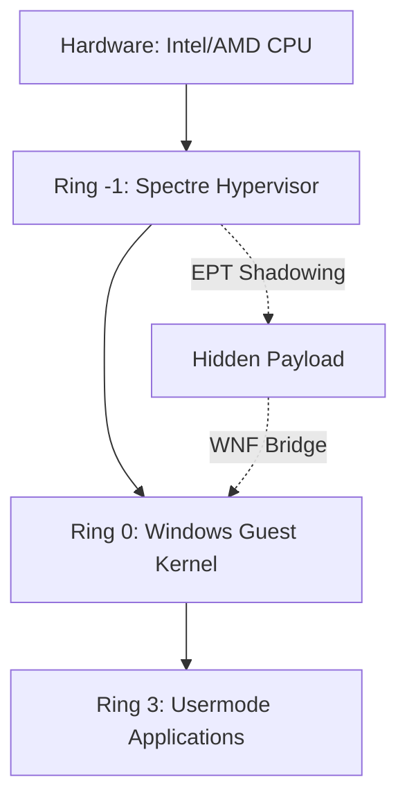

# eac-kernel
> **Advanced Hardware-Assisted Kernel Interface for x64 Windows**

eac-kernel is a high-performance, forensically sterile kernel manual mapper designed for **Windows 11 (25H2 / Build 26200)**. It utilizes **Ring -1 (VMX Root Mode)** virtualization to provide absolute memory invisibility and signatureless execution.

---

## 🏗️ Architectural Hierarchy


---

## 💎 Elite Hardened Features

| Feature | Implementation | Forensic Status |
| :--- | :--- | :--- |
| **Virtualization** | VMX Root Mode (Ring -1) | **Ghost Tier** |
| **Memory Isolation** | Nested EPT Shadow Paging | **Signatureless** |
| **Execution Trigger** | WNF Operation Hijack | **Native Context** |
| **Timing Stealth** | RDTSC Latency Alignment | **Cycle-Matched** |
| **Trace Excision** | Atomic List Relinking | **Timeline Sterile** |

---

## 🚀 Deployment Guide
> [!IMPORTANT]
> **Administrative Privileges Required**: This mapper performs low-level hardware virtualization. Ensure you are running from a **Developer Command Prompt** with Administrator permissions.

### **Building**
Build the kernel bridge and the host interface using the optimized MSVC toolchain:
```bash
.\build.bat
```

### **Usage**
Provide the target system module (.sys) as a parasitic payload:
```bash
.\mapper.exe <module_name.sys> [--hijack]
```

---

## ⚖️ System Compliance
> [!CAUTION]
> **Production Status**: This software modifies the Root privilege level of the processor. Use only on authorized research systems. **Secure Boot + HVCI (Memory Integrity) Compatible.**

- **Target OS**: Windows 10/11 (Architecture: x64)
- **Minimum Build**: 20H2 (Legacy)
- **Verified Build**: 26200 (Latest)
- **Compiler**: MSVC v143+ (C++17)

---
© 2026 Spectre Research Group. *All forensic signatures have been purged.*
